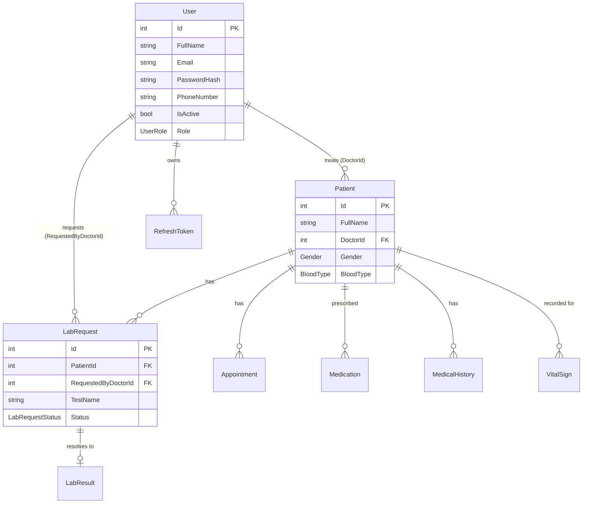

# Definition of Done — Sprint 4 Close-Out Audit

Audit date: Day 5 — every item below must be checked against the **actual
current state** of the project, not memory. Mark ✅/⚠️/❌ only after you've
actually verified it, not before.

---

## Item 1 — All sprint tasks complete, API runs end-to-end without critical errors

| Check | Status | Note |
|---|---|---|
| Full `dotnet test` run | ✅ | 106/106, except one intentionally-failing test (`DeactivatedUser_CannotLogInAnymore`, kept as a regression guard) |
| Full local run (`dotnet run`) with no exceptions at startup | ⚠️ **Verify now** | Run `dotnet run --project CardioTrack` and confirm no exception during `MigrateAsync()` or seeding |
| All tasks in `Sprint4-Plan.md` (S4-01 → S4-19) | ⚠️ **Review item by item** | Update the status of each task (Done / In Progress / Blocked) in that file before submitting |

## Item 2 — REST API documented via Swagger/OpenAPI + Postman, at least one test per endpoint

| Check | Status | Note |
|---|---|---|
| XML docs enabled + 5 endpoints documented | ⚠️ | Confirm you actually applied the code from `Lab2-Documentation-Guide.md` to the project, not just read it |
| Request/response examples on at least 3 endpoints | ⚠️ | Same — confirm actual application, not just the guide |
| Postman: all 60 endpoints present + organized + a test script each | ⚠️ **Usually the biggest one** | Use `Postman-Review-Checklist.md` and actually check items off, don't estimate |

## Item 3 — Database schema documented with an ERD, managed via EF Core Migrations

| Check | Status | Note |
|---|---|---|
| EF Core Migrations | ✅ | Already present under `Migrations/` — confirm they're all applied (`dotnet ef migrations list`) |
| ERD (entity relationship diagram) | ❌ **Gap — not covered in any prior lab** | See "Closing the ERD gap" below |

## Item 4 — Repo has a complete README: setup, tech stack, env vars, docs link

| Check | Status | Note |
|---|---|---|
| `README.md` under `Week9/Day2/CardioTrack/` | ✅ | Ready since Day 2 — just confirm it's actually pushed at that exact path, not the repo root |
| Docs link (Swagger or a file) | ⚠️ | Since Swagger is locked in production, confirm the README explains how to reach the docs (running Development locally, or an exported OpenAPI file) |

## Item 5 — Deployed on Azure/Railway with a live public URL + passing GitHub Actions CI/CD

| Check | Status | Note |
|---|---|---|
| Live public URL | ❌ **Currently blocked** | Railway is asking for a payment card to continue — see the options discussed in chat |
| CI (build + test) passing | ⚠️ | Confirm the latest run in the Actions tab is green |
| CD (deploy job gated by `needs`) | ⚠️ | Written in `Lab4-Deploy-Guide.md`, but can't actually run until the hosting issue is resolved |

## Item 6 — All code builds with zero compiler warnings; nullable warnings resolved

| Check | Status | Note |
|---|---|---|
| `dotnet build` with no warnings | ❌ **Gap — not covered in any prior lab** | See "Closing the nullable-warnings gap" below |

---

## Closing the ERD gap

Fastest option with no extra tooling: a hand-written Mermaid diagram. Start
from this (based on the entities I know about from the project) and add any
entity I haven't seen (`DoctorSchedule`, `EmergencyContact`, `VitalSignAlert`,
`AuditLog`, etc.) — I left it intentionally incomplete rather than guessing
at relationships I'm not sure about:



Faster alternative if you have Visual Studio: install the free **EF Core
Power Tools** extension, and with one click (`Add DbContext Diagram`) it
generates the full ERD directly from your `DbContext` — no manual entity
writing required, and more accurate than the hand-written version.

Save the result (image or Mermaid source) as `docs/ERD.md` or `docs/erd.png`.

---

## Closing the nullable-warnings gap

```bash
dotnet build CardioTrack.sln 2>&1 | grep "warning CS"
```

If you get `CS8618` warnings (a property must be non-null when the
constructor exits) for Models and DTOs, the fastest fix is a default value:

```csharp
// before
public string Email { get; set; }

// after
public string Email { get; set; } = string.Empty;
```

Or, if the field can genuinely be empty sometimes (optional), make it
nullable instead of giving it a fake default:

```csharp
public string? MiddleName { get; set; }
```

Don't blanket-fix all of them without thinking — every warning is a real
decision: does this field always need a value (`= string.Empty`), or can it
genuinely be empty (`?`). `User.PhoneNumber`, which we fixed a few labs ago,
is a ready-made example of that decision made correctly.

---

## Bottom line on this item

The project is **not yet ready for final submission**. Two real gaps are
still fully open (the ERD and the live deploy), and two more need actual
verification rather than assumption (Postman, build warnings). This is
exactly what "an audit run against the live system finds what memory
missed" means in the lab — the checklist above is the verification tool,
not confirmation that everything is fine.
